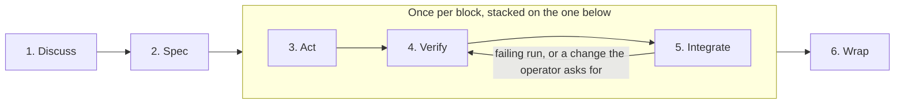

# Workflow

How work moves through this repository: tiers, phases, blocks, the stack, the pull request, Wrap, adjacent defects,
evidence and review findings. Decided by `agents/specs/2026-10-08-stacked-blocks.md`, whose decisions carry the
reasons this document leaves out.

## Vocabulary

- **Lot**: what one work session delivers. Discuss and Spec run once per lot.
- **Block**: the smallest change that can merge to `main` on its own; one block, one pull request.
- **Stack**: a lot's blocks, each branch cut from the previous block's, each pull request targeting its parent branch,
  the first targeting `main`.
- **Lead**: the main loop the operator talks to. Keeps the lot's thread, creates the branches, rewrites the stack,
  writes no block of a tier Spec lot.
- **Closing block**: a tier Spec lot's last block, stacked on top of the others, holding Wrap's corrections.
- **Teammate**: a named background agent that implements one block, stays idle once its pull request is open, and is
  stopped when the stack merges.
- **Tier** (Direct or Spec) is a property of the lot; **defect class** (1, 2 or 3) is a property of an adjacent defect
  found on the way. Two words, so neither is read for the other.

## Tiers

- **The tier is the operator's decision**: the lead states the recommended tier and its trigger, then waits.
- **Recommend Spec when both fit**; if its trigger surfaces mid-task, stop and ask again.

| Tier   | Trigger | What runs |
|--------|---------|-----------|
| Direct | One block: no design decision, no new dependency, no change to an operator-facing surface (config keys, either DB's schema, webui routes, metrics, notifications, the `merge`/`compact` CLIs, compose env) | Act, Verify (ending with the handoff), Integrate and Wrap, inline by the lead. No review unless the operator asks for one. One branch (`git switch -c`), one pull request, or the docs-only local merge (Integrate). |
| Spec   | Anything else | Discuss, Spec, then per block Act, Verify and Integrate in a teammate, then Wrap with the holistic review. |

## Branches

- **`main` is integration-only**: never edit on it. Branch before the first file is written, except a tier Spec lot's
  spec (Spec).
- **Naming**: `<type>/<kebab-slug>`, `<type>` a conventional-commit type (`feat`, `fix`, `docs`, `chore`, `test`,
  `refactor`). A tier Spec lot's branches are named in its spec's block table.
- **Tier Direct branches in place** (`git switch -c`). **Tier Spec stacks in the one working tree**, never a worktree
  per block: `gh stack` 0.1.1 refuses to rebase a branch checked out in another worktree.
- **Committing is cheap**: commit autonomously. Stage paths explicitly.

## What a block is

- **The smallest change that can merge to `main` on its own**, on three conditions:
    1. **Green alone.** `uv run poe check` passes at its tip, so a block never ends between a failing test and the
       implementation that answers it.
    2. **Coherent alone.** Nothing it adds is unreachable: every new port method has a caller, every config key is read.
       A surface whose consumer arrives in a later block is named in the spec and in the pull request.
    3. **Readable alone.** **Under 500 changed lines and under 20 changed files**, both strict. Past either bound the
       block splits, or the spec states in one line why it cannot.
- **A changed line is counted per hunk of `git diff -U0`**: each hunk costs the larger of its deleted and added counts,
  and the block costs the sum.
- **Outside both counts**: the four dated directories (`agents/specs`, `agents/plans`, `agents/handoffs`,
  `agents/reference`) and the files `.gitattributes` marks with a **bare** `linguist-generated` (`uv.lock`). Never
  `=true`: git then reports the value `true`, and the pathspec below no longer excludes the file.
- **Measured after committing**, against the block's parent branch (`main` for the lot's first block):

```bash
X=(-- ':/' ':/!agents/specs' ':/!agents/plans' ':/!agents/handoffs' ':/!agents/reference' ':(top,exclude,attr:linguist-generated)')
git diff -U0 <parent>...HEAD "${X[@]}" | awk '/^@@/ { split($2, o, ","); split($3, n, ","); b = (2 in o) ? o[2] : 1; d = (2 in n) ? n[2] : 1; s += (b > d ? b : d) } END { print s + 0 }'
git diff --name-only <parent>...HEAD "${X[@]}" | wc -l
```

## Phases



Tier Direct is not drawn: it skips Discuss, Spec and both reviews.

- **Every agent the lead dispatches is named and runs on Opus**, reviews included. A name lets a report that does not
  arrive be asked for again instead of paying for a second run.
- **A review agent is not a correspondent**: one brief out, one report back. Its report goes to
  `.reviews/<lot>-<mandate>.md` (gitignored), and its message holds only that path, its counts by severity, its top
  three findings and `END OF MESSAGE`, since the message channel truncates.

### 1. Discuss

- **Explore the project, read `BACKLOG.md`, ask the operator questions to align.** No code, no files.

### 2. Spec

- **One document, `agents/specs/<ISO date>-<slug>.md`**, in English, its block table included. No separate plan: the
  teammate's brief is the one Act states.
- **Written untracked in the tree on `main` until approved**, then committed in the first block's first commit.
- **The block table numbers blocks by tens and names each branch**, so an inserted block takes a free number.
- **Every decision the spec settles states its reason.** It names every adjacent `BACKLOG.md` item and why each stays
  open, or says there is none.
- **Reviewed by a named agent on `agents/reviews/spec.md`**, its findings closed, then by the operator.
- **No block of a tier Spec lot starts before the operator has read and approved the spec file.** Agreement on a
  summary of the spec in conversation is not that approval.
- **The spec ships in the first block's pull request.**
- **A claim corrected after the operator's approval keeps `(Corrected: <what changed>)` beside it**, which the holistic
  review checks against the diff.

### 3. Act

- **The lead cuts each block's branch with `gh stack init` / `gh stack add`** before the block's first file is
  written, never with `-A` while an untracked file it does not mean to commit lies in the tree. `gh stack init` checks
  the top branch out, so the lead switches back before committing to a lower one. Only the lead rewrites the stack.
- **One teammate per block, one working at a time.** The next block starts once the previous one is green locally and
  its pull request open, not once it has merged.
- **The brief points at the block's row in the spec, the spec, `AGENTS.md`, this document's Act, Verify, Integrate
  (the pull request's body included) and Defect classes, and the branch, and restates nothing.**
- **Strict TDD**, as `AGENTS.md` states it.
- **An adjacent defect takes its class** (Defect classes). A defect class 2 question stops the teammate.
- **The teammate speaks only when it stops**: a defect class 2 question, a blocker (a denied permission included), or
  continuous integration has started. The lead forwards the operator's answers verbatim and never answers a class 2
  question itself.

### 4. Verify

- **Entirely on the local branch**: the teammate runs `uv run poe check` in the foreground and fixes until green.
- **It measures the block** with the command under "What a block is".
- **The teammate of the last block before the closing one drafts the handoff** from the lot's block reports
  (`gh pr view`) and its own, for the closing block to correct.

### 5. Integrate

- **The teammate opens its pull request ready for review with `gh stack submit --auto --open`**, sets the title (a
  conventional commit) and the body with `gh pr edit`, sends the link to the lead with the report that continuous
  integration has started, and ends its turn.
- **The lead arms `gh run watch <id> --exit-status` in the background** as soon as a run starts, before answering,
  the id from `gh run list --commit <pushed sha> --limit 1 --json databaseId -q '.[0].databaseId'`, retried while
  empty. Not `gh pr checks --watch`: right after a push it exits at once on "no checks reported".
- **A failing run, or a change the operator asks for, is fixed in the block it concerns**: once the active teammate has
  stopped with its work committed and the tree clean, the lead forwards it by name, the teammate checks its branch
  out (`gh stack checkout <branch>`), commits the fix, runs the gate and stops. The lead then cascades with
  `gh stack rebase --upstack` and pushes with `gh stack push`. On a conflict the lead aborts
  (`gh stack rebase --abort`), the conflicting branch's teammate rebases it onto its new parent and runs the gate, and
  the cascade resumes. Every teammate whose branch moved is told, and the one stopped for the fix is resumed.
- **Before the operator merges, the lead rebases the whole stack onto the current `main`** with `gh stack rebase` then
  `gh stack push`, since `main` requires up-to-date branches and moves during a lot (Dependabot, the weekly
  `amule-bump`, docs-only merges), and waits for every run to be green again.
- **The operator merges, after reading the whole stack, with `gh stack merge --rebase`**, the only method the
  repository allows. Never on a green gate alone, and never the lead's command: non-interactive, it merges the whole
  stack without prompting. A tier Direct pull request merges the same way, by the operator
  (`gh pr merge --rebase`).
- **No admin merge**: `main` requires the `validate / gate` check, and `enforce_admins: false` lets a local admin merge
  bypass it silently.
- **Docs-only exception, tier Direct**: a diff touching only `docs/**`, `agents/**` and root `*.md` may be committed or
  merged locally to `main`, with no pull request.
- **On the operator's "merged"**, the lead stops every teammate of the lot by name, brings the working tree back to
  `main` (`git switch main && git pull --ff-only`) and deletes the lot's local branches.

#### The pull request's body

- Write for a tech lead who knows the project's architecture and language, has not read the specification, and will not
  read the code line by line. The operator reviews a whole stack of pull requests in one sitting, so each must stand
  alone: a body that needs the specification sends the reader away from the pull request.
- Give the context, then why the change is needed, then how it is done at the level of the architecture. Never describe
  what changed, file by file or line by line. The diff already shows what changed; the reader's question is whether this
  is the right change. If understanding it needs code details, the change probably wants reorganising.
- Fit the length to the change: a small change reads in a few lines, and 50 lines of text is a ceiling for the largest,
  not a target. A mermaid diagram's code does not count; a code block does. A body longer than the change it explains
  costs the reviewer more than the diff, and a long body gets skimmed.
- Use whatever makes the review easier: a mermaid diagram, a table, or a short code example. A toy example can show a
  behaviour better than a description of it.
- A diagram shows one thing, with few nodes, in the form that fits it: a sequence diagram for an exchange between
  components, a state diagram for a lifecycle, a flowchart for a decision. If it cannot be read at a glance, split it or
  leave it out. A diagram the reader has to decode costs more than the paragraph it replaces.
- Do not comment on code quality, list risks, or list what was not verified. Code quality speaks for itself in the diff.
  A list of risks or of unverified points anchors the reviewer on what the author already knows, when the review is
  worth most on what the author does not know.
- Put the block's report last, collapsed: `<details><summary>Block report, for the handoff</summary>`, then
  `</details>`. It holds the evidence (gate, continuous integration, budget, and per new behaviour the test watched
  failing with the line of its failure output), the departures from the spec, the class 1 fixes, the class 2 questions
  with their answers, the pitfalls and what was not verified. The handoff is written from these reports, so lose nothing
  it needs; collapsed, the report stays out of the reader's way. Continuous integration and the stack are already shown
  by GitHub, so the visible body repeats neither.

### 6. Wrap

- **Once per tier Spec lot, once the pull request of the last block before the closing one is open**, before the
  operator's review. Tier Direct wraps inline on its one branch: (c) and (d), without the counts, at the end of Verify,
  before Integrate; (e) and (f) once its pull request merges.
- **(a) The holistic review**, by a named agent on `agents/reviews/holistic.md`, over
  `git diff origin/main...origin/<top branch>`: the stack is not merged yet, so the merge base with `main` is the lot's
  start, even after `main` moves or the stack is rebased onto it. A lot of one block is offered its waiver and the
  operator decides; tier Direct has none. Accepted limit: what reaches `main` outside a lot (tier Direct, Dependabot,
  `amule-bump`) is never read holistically.
- **The closing block, stacked on top with its own pull request**, then holds: (b) the holistic findings fixed, each
  named in the handoff with its exit; (c) `BACKLOG.md` reconciled; (d) the handoff, in
  `agents/handoffs/<ISO date> - handoff - <context>.md`, drafted in the last block before the closing one and
  corrected here: current state, what was built, pitfalls, what is not validated, next step.
- **(d) also counts the lot's fix-backs, cascaded rebases and the runs they re-triggered**, plus any body the operator
  called unreadable unprompted. More runs re-triggered than blocks, or an unreadable body, means stacking costs more
  than pull requests in series.
- **(e) The lead reports what was done and the friction met.**
- **(f) After the stack, or tier Direct's pull request, merges, the lead proposes a release if the lot changed what the
  image ships**, announcing the version number first. The operator decides; the tag is then pushed as `AGENTS.md`
  describes (`git tag`). A lot that changes only documents or process ships nothing.
- **The closing block splits like any other** when it passes a bound.

## Defect classes

An adjacent defect found on the way takes one class. No hunk of a diff should be unexplainable by the request or by an
answer the operator gave.

1. **Trivial, obviously correct and contained**: fixed in the change that finds it, flagged in its report.
2. **Larger, and reachable in this lot**: stop and ask the operator **at the moment of discovery**, stating the defect,
   the size of the fix and the block it would join. Fixing it unasked and backlogging it silently are both wrong.
3. **Refused by the operator, or another lot's**: `BACKLOG.md`, after the operator's agreement.

## Review findings

A review finding exits as one of: fixed in the lot (the default); a `BACKLOG.md` item (work someone will do); an
accepted limit, written where the decision lives, never copied to the backlog; or refused, with its reason in the
handoff. Wrap states which exit each finding took.

## Evidence

- **Nothing is asserted without the command that established it.**
- **A measurement a document carries is dated**: re-run it before acting on it, and correct the document when the
  numbers differ.
- **A check that cannot fail is not a check**: before offering a command as evidence, name the output that would
  prove it wrong.
